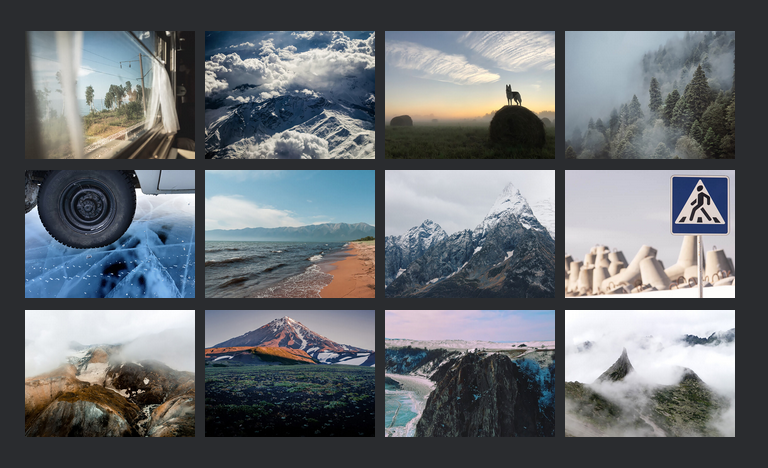

# Проект:Путешествие по России
---
## На данный момент произведена работа:
- Оптимизация изображений.
- Построение файловой структуры по **БЭМ**
- Создание адаптивной вёрстки по макету.
- Реализовано плавное сжатие сайта.
---
## Используемые технологии:
&nbsp;
  &nbsp;
  &nbsp;
---
## Используемая литература:
- https://tinypng.com/
- https://habr.com/ru/
- https://codepen.io/
- http://htmlbook.ru/
- https://html5book.ru/
---
## Обзор проекта:
- Интро
- Photo-grid
- Cover
- Places
---
 __<h2 align="center">Интро</h2>__
_
Здесь проект о путешествии по России.
_

__<h2 align="center">Photo-grid</h2>__
_
В Фото-грид размещен блок, с картинками, которые расположены в грид среде.
_

__<h2 align="center">Cover</h2>__
_
В Ковер, реализованно наложение эфекта затемнения с определенной прозрачностью.
_

__<h2 align="center">Places</h2>__
_
Плейс, знакомит нас о красиввых местах России, с фото и ссылками.
_

 ### [ПРОЕКТ:Путешествие по России](https://miskevichstanislav.github.io/russian-travel/)
